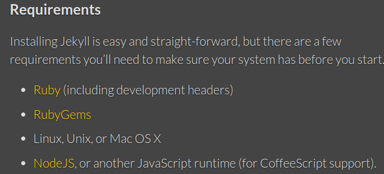

Ola seres humanos, vocês conhecem o Jekyll? Pois deveriam, estarei começando com este post uma serie de posts sobre Jekyll e todo seu universo, ou seja, o produto que teremos no final é um guia definitivo sobre Jekyll. Acompanhe xD

Jekyll é a plataforma a qual este pequeno blog esta sendo escrito. Mas Luan, o que exatamente é o Jekyll? Bom ele é uma plataforma que gera sites estáticos. Estáticos no seguinte sentido, ele nele não exite "backend", muito menos banco de dados, então como raios esta coisa vai guardar e exibir meus posts? Simples, com arquivos estáticos, arquivos esses que são convertidos completamente a partir do formato Liquid ou Markdown, após esse processo ele já esta para ser publicado no seu web server favorito.

Ele foi desenvolvido para funcionar pelo GitHub Pages, isso significa que ele poderá ser hospedado la, DE GRAÇA :) olha que beleza, 0800.

Sob o meu ponto de vista a principal vantagem em usar o jekyll é a sua praticidade, você apenas escreve em um arquivo, sobe o mesmo para o seu web server e pronto, It´s done. Invés de matar uma mosca com um canhão, utilizamos um mata moscas, digo isso no seguinte sentido, para o caso deste blog e de muitos outros é que não precisamos de todo o aparato que plataformas como Wordpress oferecem, queremos apenas um simples sistema de blogs, eu sei que no paralelo acima ficou parecendo que o jekyll é mais fraco que as plataformas tradicionais de blogs, porem o fato é que elas nasceram para propósitos diferentes, nesse ponto então que mora o paralelo, você não mata uma mosca com uma arma certo? (Pelo menos não deveria).

Ok, me convenceu e como eu instalo ele e começo o meu blog?

É simples, porém antes se você usa Windows, tenho más noticias pra você

Esse são os requerimentos do sistema que estão no site oficial do Jekyll.

Este tutorial se aplica para sistemas debian-like

>$sudo apt-get install ruby-full
>$sudo apt-get install rubygems
>$sudo apt-get install nodejs

A melhor forma de instalar o Jekyll é pelo terminal, então temos que

>$gem install jekyll

Pronto, o Jekyll já esta instalado em sua maquina e pronto pra rodar. Agora é somente entrar em um diretorio executar

>$jekyll new /CaminhoDoSeuDiretorio

Modificar o layout, e começar a escrever.
Próximos posts explicarei mais detalhes sobre Jekyll, como publicar utilizando o GitHub, instalar templates, acalme-se pequeno gafanhoto HAHA.

No site do [Jekyll](http://jekyllrb.com/) encontra-se a documentação e maiores informações sobre.
