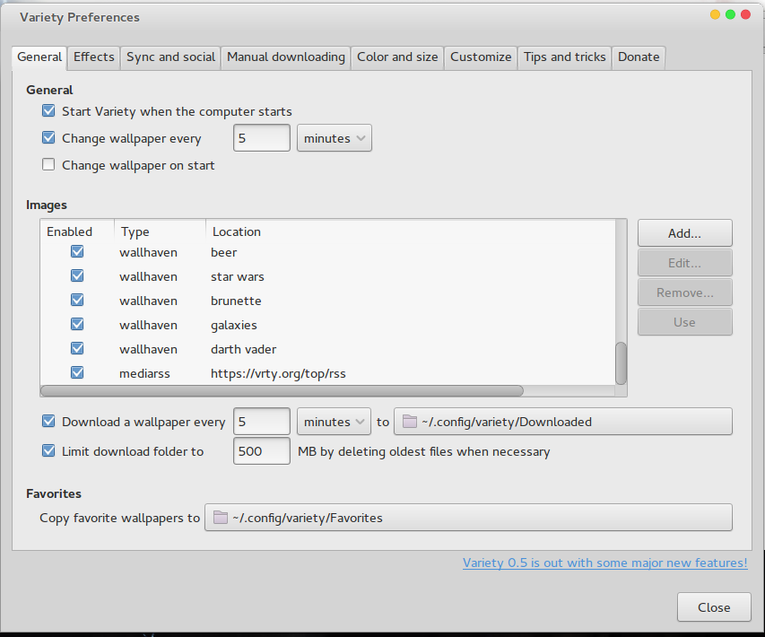

Ola seres humanos, faz um tempinho que eu não apareço por aqui HAHA. Pois bem o post de hoje é rápido, se trata de uma dica pra quem usa linux. Se você é um ser igual a minha pessoa da qual não suporta o mesmo wallpaper por muito tempo eu lhe apresento uma ferramenta deveras interessante, trata-se do Variety.

Essa ferramenta permite o download de imagens a partir de alguns bancos de imagens na web e os coloca trocando de tempos em tempos na sua área de trabalho. É similar aos wallpapers automáticos que existente no sistema da Janela, porem que eu me lembre la não era permitido o download de wallpapers pela internet.

Confesso que quando instalei pela primeira vez aqui na maquina, pensei que fosse apenas um aplicativo que baixaria imagens aleatórias e as colocaria em minha área de trabalho, porem ele faz um pouco mais além disso, permite que a escolha de palavras chave para encontrar as imagens, sincroniza entre múltiplos computadores (recurso esse do qual eu não pude testar ainda),tem um sistema de rank das imagens, você ainda pode sincronizar seus wallpapers na nuvem, existe a possibilidade de configurar o tempo para a troca/download do wallpaper, ele salva as imagens favoritas em uma pasta, traduzindo uma beleza.

Ok, me convenceu e como eu instalo na minha maquina?

É simples, porém ele esta apenas disponivel para linux

>$sudo add-apt-repository ppa:peterlevi/ppa

>$sudo apt-get update

>$sudo apt-get install variety

Feito, agora é só ir configurar as fontes de download das imagens e a pasta onde elas serão salvas, bem como sua conta para salvar as configurações na nuvem.
No [site](https://vrty.org/help) encontra-se mais informações e as formas de instalação para outras plataformas. Caso queira saber como anda meu desktop [Chega ai](https://vrty.org/user/~luandryl)

