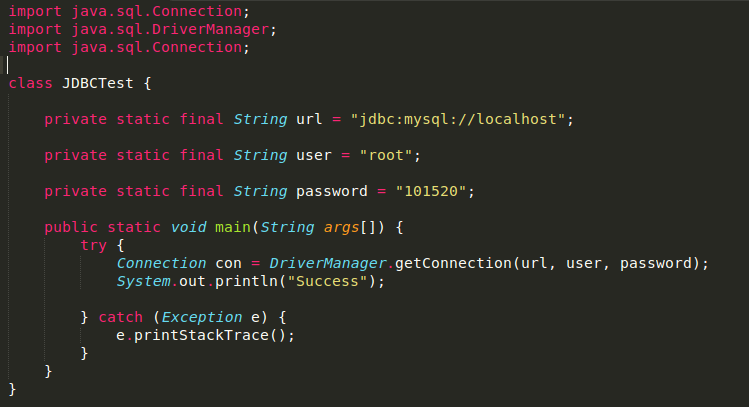
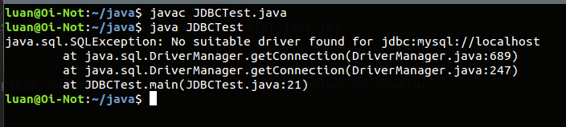
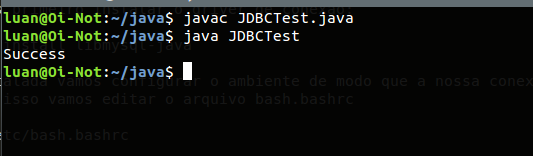

Ola seres humanos para variar faz tempo que eu nao apareço por aqui, na verdade eu não tenho disciplina (e tempo tambem) nenhuma para escrever constantemente HEHE. No post de hoje vou fazer um pequeno tutorial de como criar uma conexão simples do Java com o MySQL apenas usando o Sublime Text.




A motivação desse artigo é bem simples, estavamos eu e um amigo na faculdade e tinhamos a tarefa de conectar o java com o mysql e realizar algumas buscas simples na base de dados, porém não queriamos utilizar nenhuma IDE. Então partimos para a nossa pequena saga, procuramos na internet por algumas horas, contudo não encontramos nada satizfatório, partimos então a procura de um professor da faculdade que pudesse nos ajudar e adivinhem, ele não sabia resolver nosso problema. Ora se não encotramos nenhum tutorial decente na internet sobre e os professores tambem não sabem como faze-lo isso acabou virando uma questão pessoal para nós hehe.

A primeira coisa que fizemos foi escrever uma classe em Java bem simples que conectasse com a nossa base de dados:

```java

import java.sql.Connection;
import java.sql.DriverManager;

class JDBCTest {

    private static final String url = "jdbc:mysql://localhost";

    private static final String user = "root";

    private static final String password = "123";

    public static void main(String args[]) {
        try {
            Connection con = DriverManager.getConnection(url, user, password);
            System.out.println("Success");

        } catch (Exception e) {
            e.printStackTrace();
        }
    }
}

```
Feito isso veio o cern do nosso problema, como incluir o driver de conexão no projeto? Afinal só fizemos a chamada do mesmo aqui:

```java
import java.sql.Connection;
```

Se executarmos o codigo no terminal encontraremos o seguinte erro:


Para tal vamos primeiro instalar o driver de conexão:

>sudo apt-get install libmysql-java

Com a lib instalada vamos configurar o ambiente de modo que a nossa conexão seja possivel a partir apenas do sublime, para isso vamos editar o arquivo bash.bashrc

>sudo gedit /etc/bash.bashrc

E adicionar no inicio do mesmo a seguinte linha:

>export CLASSPATH=$CLASSPATH:/usr/share/java/mysql-connector-java.jar

Logo após vamos reiniciar o sistema para que as mudanças sejam aplicadas:

>sudo reboot

Com as mudanças aplicadas vamos recompilar nossa classe java e devemos obter o seguinte resultado no terminal:



Chegamos ao fim desse pequeno tutorial, logicamente esse método não é valido para grandes projetos, porem para o nosso caso que apenas queriamos de forma rapida e com o sublime nos conectar a uma base de dados e realizar pequenas operações na mesma é extremamente valido.
