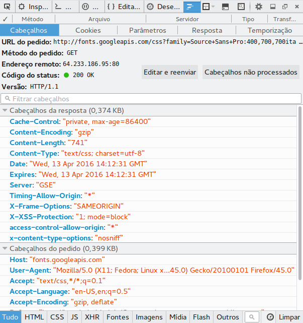
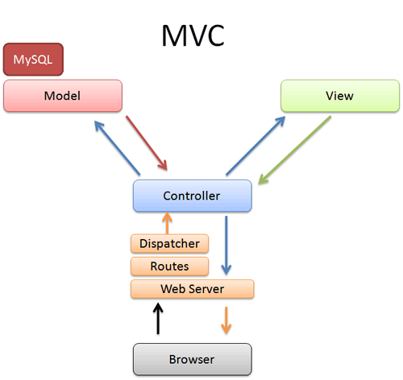

Ola seres humanos, hoje eu vou falar um pouco sobre os pricipais topicos que permeiam o desenvolvimento de aplicações web. Pega um lanchinho e vem com o tio HEHE

## Como funciona a WEB:
Qualquer aplicação distribuida na web funciona da seguinte maneira,
uma troca entre requisição do cliente e a resposta do servidor
aquela requisição.

Os clientes são os usuarios da web conectados na internet, sejam eles de qualquer
natureza, normalmente fazendo o acesso por meio dos navegadores.

Os sevidores, por outro lado, são os computadores que armazenam as paginas/sites/arquivos/apps
e quando o cliente faz uma requisição é o servidor o responsavel responder essa requisição, mostrando assim o conteudo apropriado.

Quando voce digita na barra de endereços ex: www.facebook.com seu navegador se conecta com o serivdor dns e pergunta e fala(exatamente dessa forma)

>(cliente)  -seguinte brother, eu tenho essa url e queria o IP resolve ai.

>(servidor) -ó, se liga, o ip dessa fita ai é 185.186.87.88

Agora que conhecemos o IP temos que estabelecer uma conexão com o serividor na porta correta. Existem diversas portas para cada IP e cada porta cumpre uma tarefa especifica Ex: porta 21 é FTP, porta 25 SMTP(email) e a 80 HTTP( HYPER TEXT TRANSFER PROTOCOL)

Pro nosso caso queremos conectar na porta 80, pelo protocolo TCP(Transfer Control Protocol)/IP e transmitindo cabeçalhos HTTP.

Como a imagem abaixo mostra:

Um ponto interessante de ressaltar é que essa arquitetura cliente servidor é statless, não guarda estado algum, assim que uma pagina é atualizada o servidor não guarda as informações que estavam presentes no estado anterior. Isso é quer dizer que ao clicar no botão de salvar e o navegador atualizar a pagina as informações do form foram elimidadas pelo servidor a menos que tenha sido feito cache da informação ou que ela tenha sido persistida numa base de dados.

## Conceitos Legais:
Beleza, entendemos como a internet funciona, agora como podemos desenvolver de forma inteligente para esse tipo de ambiente?

Pra isso antes eu queria explicar um pouco de alguns conceitos importantes pra o desenvolvimento de software em geral.

### Modularidade:
Significa que o sistema não vai ter codigo legado, ou seja, as camadas/diviões do projeto são bem estabelecidas e cumprem um papel unico. Logo conforme formos juntando os modulos o produto final vai ter essas três caracteristicas.

### Velocidade:
Velocidade tanto no desenvolvimento quanto ao lado da aplicação. No desenvolvimento é simples de explicar, se a minha aplicação é dividida para o desenvolvimento podemos pensar em entregar um modulo pra cada equipe desenvolver e 'juntar' tudo depois. E do lado da aplicação, é muito mais veloz porque o fluxo de informação está claro, ou seja, o dado não da muitas voltas dentro da aplicação.

### Escalabilidade:
Escalar uma aplicação é pensar no amanha, e se crescer? E se o numero acessos unicos passar de 1.000 pra 1.000.000? Minha aplicação esta preparada? Meu banco esta preparado pra isso? Escalar uma aplicação não se resolve apenas com Padrão de Projeto mas concerteza é um dos fatores que influenciam pro sistema crescer saudável.

### Manutenção:
Imagina que daqui a 6 meses quebra uma funcionalidade do sistema e voces vão ter que corrigir, e dai? Se o projeto seguir essa ideia de modularização juntamente com as boas praticas de Orientação a Objetos vai ficar facil encontrar e resolver o ponto de falha no sistema.

Outro cenario legal de pensar é, e se depois de 6 meses o cliente quiser uma nova funcionalidade? Fica facil de implementar porque teoricamente é só encaixar mais um modulo e esta pronto.

Contudo, todavia, entretanto, pra esta bagaça funcionar um dos pontos mais importantes, que eu levei um bom tempo pra me atentar, é que pra um sistema ser modular e conseguir ter todas as caracteristicas que foram citadas acima implica diretamente em todo mundo estar se falando

O exeplo do lego é otimo. Cada peça de lego é um modulo e juntando as peças eu crio uma funcionalidade/sistema. Mas como o lego fica junto e não se separa? Pelos conectores/encaixe, na nossa analogia com uma aplicação esses conectores são a resposta que aquele modulo devolve e o encaixe é o tipo de resposta esperada pelo modulo seguinte. Se a conversa não estiver sintonizada, fodeu, teu sistema vai quebrar naquele ponto e o usuario vai receber uma linda mensagem de erro, mensagem essa que não foi tratada pelo sistema.

## Modelo MVC

Esse é o cara, MVC é um padrão de projeto usado DE QUILO quando falamos em WEB e a resposta do porque é simples, ele consegue condensar os conceitos legais discutios acima dentro da arquitetura cliente serivor.
Os frameworks mais conhecidos/utilizados pra web hoje usam o modelo MVC. Temos varios exeplos como Django(python), ZendFramework(PHP), CakePHP, Locomotive(Js), e uma infinidade ed outros

### Model
Essa é a camada de modelo/persistencia, cada tabela do banco tem uma representação na camada de modelo/persistencia, a unica responsabilidade desse modulo é conversar com o banco.

### View:
Visão, ou SEJE, HTML, CSS, JS, não tem muito segredo ou particularidade dessa camada, porem é aqui que tudo acontece porque é aqui que o cliente vai usar de fato o seu sistema.

### Controller:
A controller tem um dos papeis mais importantes dentro dessa arquitetura, porque é ela que vai controlar toda essa bagaça, quando a view precisar listar dados da base, por exemplo, ela que vai pedir esses dados pra model e devolver pre view. Quando um cadastro é realizado é a controler que vai pegar os dados da view e mandar pra model persistir. Aqui tambem cabe as regras de negocio, calculos especificos, ou seja é aqui que eu controlo o fluxo dentro do meu sistema.

## Conclusão
Aqui foi abordado de forma rasa quase os principais temas que permeiam o desenvolvimento de aplicações web. Tem muuuito pano pra manga ai, nas 3 partes da palestra.
O cara que for ficar responsavel por subir a aplicação no servidor tem que manjar bem sobre o protocolo TCP/IP e como ele conversa com o HTTP. Os gerentes de projeto tem que manjar de projetar em MVC, os programadores tem que manjar MVC pra conseguir implementa-lo, todo mundo tem que pensar nos Conceitos legais que eu disse pro conjunto funcionar de forma natural.

Ou SEJE, vão existir mais posts aqui sobre o tema futuramente.

------

Essa post foi feito para uma apresentação na Empresa Junior de Computação na UTFPR-CP, os slides da apresentação estão [aqui](https://goo.gl/iJEydC)
