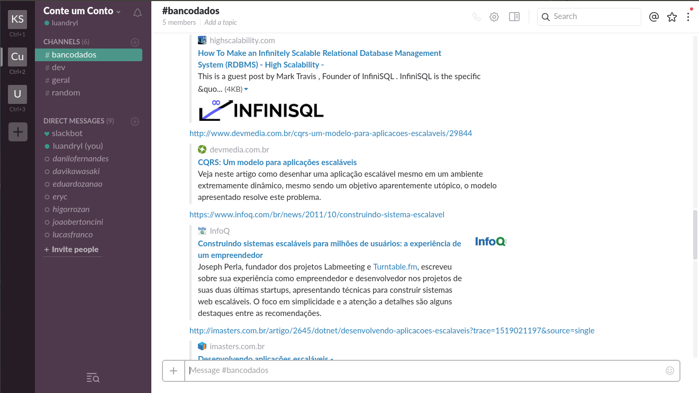
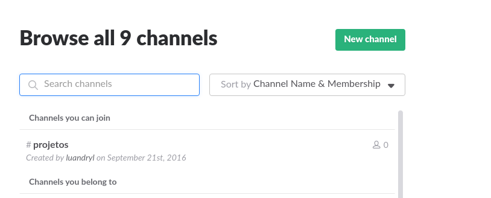
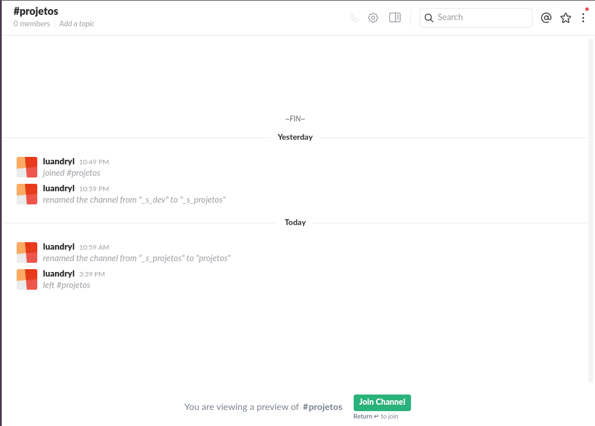

Ola seres humanos, tudo de boa? Comigo tá tudo suave, obrigado por perguntar. Hoje vamos trocar uma ideia sobre um tema um cadin doloroso, comunicação entre times. O post é meio longo mas vai valer a pena.

Pensemos em um cenário onde a organização está dividida em times. Com times quero dizer uma pequena equipe de pessoas lideradas por alguém. Ora, e quem lidera os times? Simples, eles fazem parte de outro time, o time de líderes ou vulgarmente conhecido como diretores que são liderados pelo presidente. Eu generalizei essa ideia de times mas pode-se aplicar isso dentro da sua organização seja ela como for. Ex: com setores, diretorias, etc…

A ideia parece promissora, a organização aparentemente vai fluir ja que cada time tem autonomia de trabalho dentro do seu campo, contudo existe um ponto muito crítico, a comunicação. As pessoas tem que se comunicar, comunicar decisões, opiniões, o que está sendo feito, o que tem que fazer, o que não foi feito, deu pra pegar a ideia?

Nesse momento algum espertinho deve estar pensando, pois bem vivemos no século 21 e na aurora do seu conhecimento sobre o mundo voce, espertinho, deve ter pensado que a melhor ferramenta é o whastapp. Eu não discordo de você caro espertinho, realmente é uma boa ideia para uma organização pequena, igual aquele seu grupo de relatório de física e é uma ótima primeira ferramenta. Mas quando a coisa cresce, precisamos crescer junto e um problema surge: Fica difícil manter a ordem e o pior manter todo mundo sabendo do que precisa saber.

Eis o porquê não funciona comigo, todos temos vários grupos pessoais no famigerado aplicativo de mensagens que vão desde conversas com a mamãe, a resenha com a novinha/novinho, o convite pra ir tomar aquela gelada mais tarde com a galera, o porn no grupo de putaria. E então no meio de todo aquele caos, surge uma notificação do grupo da empresa dizendo que o prazo final para entregar aquele importantíssimo relatório é segunda. Vai funcionar? Não, não vai funcionar, a mensagem não será entregue, a maioria não vai dar a devida importância pra sua mensagem do relatório no meio do caos que é a vida particular dela.

A conclusão que tiramos do cenário acima é simples vida pessoal tem que ficar de um lado e a profissional do outro. Mas e agora José? O que fazer?

Vem com o tio: A solução para esse problema é um cara chamado Slack. Como eles mesmo definem “Team communication for the 21st century”. A idea deles é simples criam-se canais de comunicação públicos ou privados e os integrantes do time entram nele. Cada canal é destinado a um propósito:

A imagem é sobre um time de desenvolvimento e tá aberto um canal destinado a banco de dados e a galera ta mandando uns artigos sobre escalabilidade com MySql e é um exemplo de um time ativo no Slack.

Coisas para se amar no Slack <3

1. Integração do time:

	Acho que isso já ficou meio que entendido, todo mundo no mesmo lugar, com acesso às informações necessárias.

2. Integração com serviços

	Essa é uma das coisas mais legais, pode-se integrar o slack com o drive/github/dropbox/trelo entre outros serviços sem contar que existe a possibilidade de criar o seu próprio serviço e integrá-lo com o Slack.

3. Search Box

	Existe ainda a possibilidade de procurar tudo que foi postado tanto na aba pessoal quanto nos canais de uma forma extremamente completa, o search box é incrível :3

4. Compartilhamento de arquivos

	Compartilhar aquele arquivo de notas, ou aquele banner para aprovação fica simples com o slack, pode-se, como ja dito, integrar com o dropbox/drive e enviar pelo Slack.

5. Code Highlight

	Compartilhar códigos no slack é legal também, apenas coloque o codigo lá e ele irá deixá-lo bonitinho, alie a isso o Search Box e o resultado é incrivel.

6. Grupos privados e Chats privados

	Transparência é uma coisa necessária dentro de uma organização, contudo nem toda informação tem de ser compartilhada com todo mundo a todo momento e eu nem preciso me justificar quanto a isso. Para resolver esse problema no Slack existe a possibilidade de criar chats privados entre membros e canais privados entre membros.

7. Acessibilidade

	Com os apps para linux/windows/ios/android você sempre está conectado com seu time onde quiser. Ahhh, agora você deve estar pensando “Então quer dizer que o líder do meu time vai poder mandar mandar mensagem às 23:00 da sexta feira?” A resposta é sim, mas você pode configurar horários de “Do not disturb”, genial, ou seja alguém pode estar trabalhando e te enviar uma mensagem precisando de alguma coisa e você só será notificado no momento correto

	Eu listei acima os pontos que acho interessante, contudo se mesmo assim você não acredita em mim eu tenho uma boa notícia pra você, você não precisa. Aqui eu vou listar alguns artigos e vídeos de pessoas que usam e casos de sucesso

[Casos de Sucesso Slack](https://www.sitepoint.com/slack-use-cases/)

[Quem tanto usa](https://slack.com/customers)

[Como a equipe do Slack usa o Slack](https://www.fastcompany.com/3040638/tech-forecast/how-slack-uses-slack)

Como você pode perceber o Slack é uma plataforma colaborativa logo espera-se que ele seja feito pelas pessoas que usam. Comunique-se, pergunte, responda, utilize a plataforma, só assim será possível começar a enxergar seus benefícios e melhorar os resultados.

Unect
------

Esse post até agora teve um propósito geral, a partir de agora ele destina-se ao nosso pessoal, Unect <3, então se você caro leitor não faz parte do time, vá embora.

Zoera, fica mais um cadin, pode ler a vontade um dos nossos lemas é a conectividade :)

Galera que entrou no slack, todos os canais estão publicos e eu quero que quem pertencer a área do canal entre nele. Quando todo mundo ja estiver devidamente cadastrado/ambientado que os canais privados passarão a ser privados. Como tudo na vida essa transição será feita com calma, utilizando aquele famoso método de resolução de integrais que Jack, o Estripador adora: Por partes.

#### Como entrar no time do Slack:

	Criem uma conta e entrem neste time unect-team.slack.com, notem primeiramente os canais ja criados

	Para entrar num time é só clicar em Channels e esta tela irá aparecer

	Clica no time e na proxima tela clique em join channel

#### OBS:

Eu não tenho certeza que  agrupar todos os times em um único lugar é a melhor ideia, porém acredito que pra um primeiro contato/teste é válido. Se passar um tempo e por exemplo o time de RH necessitar de canais mais específicos, talvez seja o caso de criar um local de comunicação específico pro RH. Esta é uma resposta meio empírica, vamos testar e ajustar melhor pro nosso caso.
